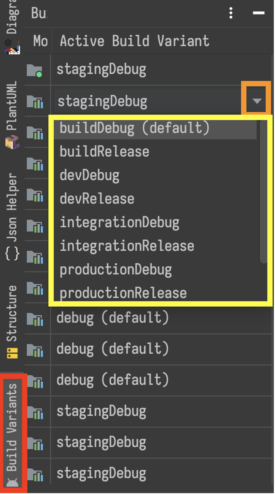
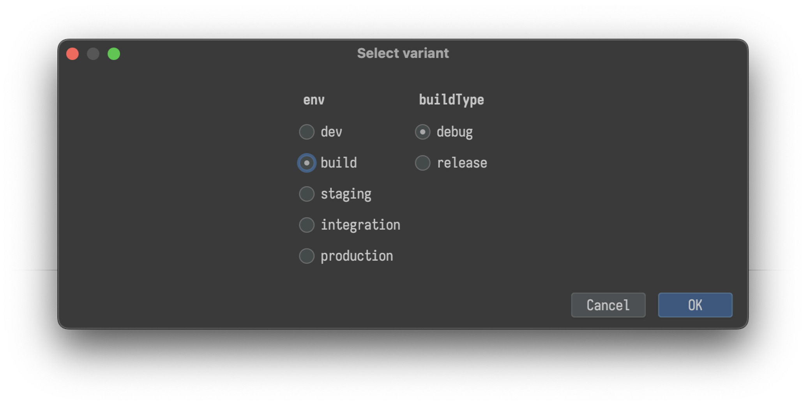

# Running the code base

#### Table of contents

1. [Running the app](#running-the-app)
    1. [Running the tests via Android Studio](#running-the-tests-via-android-studio)
    2. [Running the tests via the terminal](#running-the-tests-via-the-terminal)
        1. [Unit tests](#unit-tests)
        2. [Instrumentation tests](#instrumentation-tests)

## Running the app

Please follow the [Android studio setup tutorial] for running the app within the IDE on either a
virtual device or a physically connected device via `adb`.

## Running the tests via Android Studio

1. Select the `buildLogic.plugins.build` product flavor from the 'Build variants' ribbon that's usually located at the
   bottom left of the active Android Studio window. If `buildLogic.plugins.build` isn't selected, click the currently
   active Build variant to show a drop down arrow, then select `buildDebug` as the value:

   

> [!TIP]
> It's recommended for developers to install the [Build variant matrix selector plugin] due to
how the 'Build variants' ribbon doesn't always apply the variant across all Gradle modules.
The plugin's default key binding of `Cmd+Shift+X` opens a window that'll apply the selected
product flavour and buildLogic.plugins.build type across all Gradle modules for the developer:


   
## Running the tests via the terminal

### Unit tests

```shell
cd $(git rev-parse --show-toplevel)

# `testDebugUnitTest` runs all unit tests in modules that don't have a product flavor.
# `testBuildDebugUnitTest` runs all unit tests in modules that have a product flavor.
./gradlew \
  testDebugUnitTest \
  testBuildDebugUnitTest 
```

### Instrumentation tests

The available tasks to run depend on the configuration of the kotlin gradle plugin. These variables
are:

* System image to use
* Device specification
* Android OS level
* Build variant of the code base

Because of this, see the proceeding command for an example mapping:

* Google Play store APIs as the system image
* Pixel XL as the device specification
* API level 30 (Android 10)
* Debug buildLogic.plugins.build type, as well as a 'buildLogic.plugins.build' product flavor aware task that's also the debug buildLogic.plugins.build type.

```shell
cd $(git rev-parse --show-toplevel)

./gradlew googleApisPlaystorePixelXLApi30DebugAndroidTest \
    googleApisPlaystorePixelXLApi30BuildDebugAndroidTest
```

[Android studio setup tutorial]: ./androidStudioSetup.md
[Build variant matrix selector plugin]: https://plugins.jetbrains.com/plugin/15632-build-variant-matrix-selector